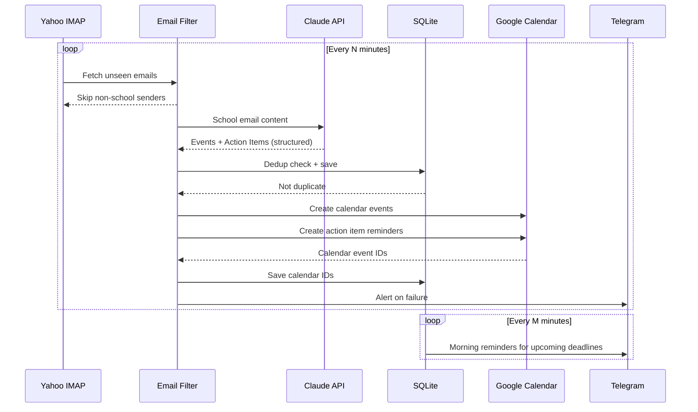

# kid-cal

School email → Google Calendar + Telegram reminder daemon.

Monitors a Yahoo Mail inbox for school communications, uses Claude to extract structured events and action items, adds them to Google Calendar, and sends Telegram reminders for upcoming deadlines.

Built as a personal productivity tool, but engineered using the same reliability, idempotency, and integration discipline applied to production backend systems.

---

## Why I Built This

Managing school schedules often means:

- Email announcements buried in an inbox
- Manual calendar entry
- Missed updates and deadlines
- Fragmented reminders

Kid-Cal automates that flow. It runs locally as a background service, turning incoming school emails into structured calendar events and pushing Telegram notifications when appropriate.

The goal was not just automation — but building it with strong engineering fundamentals.

---

## How It Works



---

## System Design

### Email Polling and Filtering

`EmailPoller` connects via IMAP and fetches unseen messages each cycle. Read-only — emails are never marked as read or modified. Filtering is two-stage:

- **Sender-level**: Only emails from configured school domains or addresses proceed to extraction. Non-school emails are cached in-memory to avoid re-checking them each cycle.
- **Grade-level**: Claude is instructed to extract only content relevant to the child's grade (school-wide events and middle school transition content are also kept).

### Structured Extraction via Claude

School emails are passed to Claude with a system prompt that instructs it to extract two artifact types:

- **Events** — calendar items with title, dates, location, all-day flag
- **Action Items** — deadlines with title, description, priority, due date

Output is validated against a Zod schema using the Anthropic SDK's structured output mode (`zodOutputFormat`). A post-extraction keyword filter removes any items that slipped through for the wrong grade.

### State Management

SQLite (WAL mode, `better-sqlite3`) tracks four tables:

| Table | Purpose |
|---|---|
| `processed_emails` | Deduplication — prevents reprocessing the same email |
| `events` | Extracted calendar events + their Google Calendar IDs |
| `action_items` | Extracted deadlines + their Google Calendar IDs |
| `sent_reminders` | Tracks which reminders have been sent |

Cross-email deduplication runs at save time — the same event title + date from different emails won't create duplicates.

### Calendar Integration

Events and action items are written to Google Calendar via a service account. Calendar event creation uses deterministic `iCalUID` values derived from the source data, making creation idempotent. If a calendar write fails, the DB record is saved without a `calendar_event_id` and retried on the next poll cycle.

### Reminders

A scheduler runs every N minutes and sends Telegram notifications for action items due within a configurable window and morning digests of same-day deadlines. Alerts are also sent on extraction failures and after 3 consecutive IMAP failures.

### Reliability

- Exponential backoff (1s → 4s → 16s) on all external calls
- Orphaned event retry — DB records without `calendar_event_id` are retried each cycle
- Graceful shutdown on `SIGTERM`/`SIGINT` with IMAP disconnect and DB close
- IMAP failure alerting via Telegram after 3 consecutive failures

---

## Engineering Principles

Even as a personal tool, the system is built with:

**Clear domain boundaries** — Ingestion (IMAP), extraction (Claude), persistence (SQLite), and integration adapters (Google Calendar, Telegram) are fully separated.

**Idempotent sync** — Deterministic calendar IDs, cross-email deduplication, and safe reprocessing mean the daemon can be stopped and restarted without creating duplicate events.

**Explicit integration adapters** — External systems are isolated, allowing notification providers to be swapped (Twilio → Telegram), failure handling to be controlled, and each layer to be tested independently.

**Minimal operational surface** — SQLite for local reliability, no cloud infrastructure required, no UI layer, background execution via `launchd`.

---

## Tech Stack

| Concern | Technology |
|---|---|
| Language | TypeScript (ESM) |
| Email | imapflow, mailparser, html-to-text |
| AI Extraction | Anthropic Claude (structured output + Zod) |
| Calendar | Google Calendar API (service account) |
| Notifications | Telegram Bot API |
| Database | SQLite (better-sqlite3, WAL mode) |
| Config validation | Zod |
| Logging | pino |
| Testing | Vitest |
| Daemon | macOS launchd |

---

## Setup

### Prerequisites

- Node.js 20+
- Yahoo Mail with IMAP enabled and an app password
- Anthropic API key
- Google Cloud service account with Google Calendar API access
- Telegram bot token and chat ID

### Install

```bash
npm install
npm run build
```

### Environment Variables

Copy `.env.example` to `.env` and fill in your values:

```bash
cp .env.example .env
```

| Variable | Required | Description |
|---|---|---|
| `IMAP_USER` | ✓ | Yahoo Mail address |
| `IMAP_PASSWORD` | ✓ | Yahoo app password |
| `SCHOOL_SENDER_DOMAINS` | ✓ | Comma-separated domains (e.g. `school.org`) |
| `SCHOOL_SENDER_ADDRESSES` | | Comma-separated individual addresses |
| `ANTHROPIC_API_KEY` | ✓ | Anthropic API key |
| `CLAUDE_MODEL` | | Defaults to `claude-sonnet-4-5-20250929` |
| `GOOGLE_SERVICE_ACCOUNT_EMAIL` | ✓ | Service account email |
| `GOOGLE_PRIVATE_KEY` | ✓ | Service account private key |
| `GOOGLE_CALENDAR_ID` | ✓ | Target calendar ID |
| `TELEGRAM_BOT_TOKEN` | ✓ | Telegram bot token |
| `TELEGRAM_CHAT_ID` | ✓ | Telegram chat ID for notifications |
| `CHILD_GRADE` | | Child's grade (default: `5`) |
| `EXCLUDE_KEYWORDS` | | Comma-separated keywords to filter out |
| `POLL_INTERVAL_MINUTES` | | Default: `5` |
| `REMINDER_CHECK_INTERVAL_MINUTES` | | Default: `15` |
| `TIMEZONE` | | Default: `America/New_York` |
| `MORNING_REMINDER_HOUR` | | Hour for morning reminders (default: `7`) |
| `DB_PATH` | | Default: `./kid-cal.db` |
| `LOG_LEVEL` | | `trace/debug/info/warn/error/fatal` (default: `info`) |

### Commands

```bash
npm run build     # Compile TypeScript
npm run dev       # Run with tsx (no compile step)
npm start         # Run compiled JS
npm test          # Run test suite
```

---

## Daemon (macOS launchd)

```bash
# Install
cp com.kid-cal.plist ~/Library/LaunchAgents/
launchctl load ~/Library/LaunchAgents/com.kid-cal.plist

# Start / stop / restart
launchctl start com.kid-cal
launchctl stop com.kid-cal
launchctl stop com.kid-cal && launchctl start com.kid-cal

# Status (PID + exit code)
launchctl list | grep kid-cal

# Rebuild and restart after code changes
npm run build && launchctl stop com.kid-cal && launchctl start com.kid-cal

# Logs
tail -f kid-cal.log           # stdout
tail -f kid-cal-error.log     # stderr

# Uninstall
launchctl unload ~/Library/LaunchAgents/com.kid-cal.plist
```

---

## Database Inspection

```bash
sqlite3 kid-cal.db ".headers on" ".mode column" "SELECT * FROM events;"
sqlite3 kid-cal.db "SELECT * FROM action_items;"
sqlite3 kid-cal.db "SELECT * FROM processed_emails;"
sqlite3 kid-cal.db "SELECT * FROM sent_reminders;"
```

---

## Status

Actively used and evolving personal automation service.

---

## License

MIT
